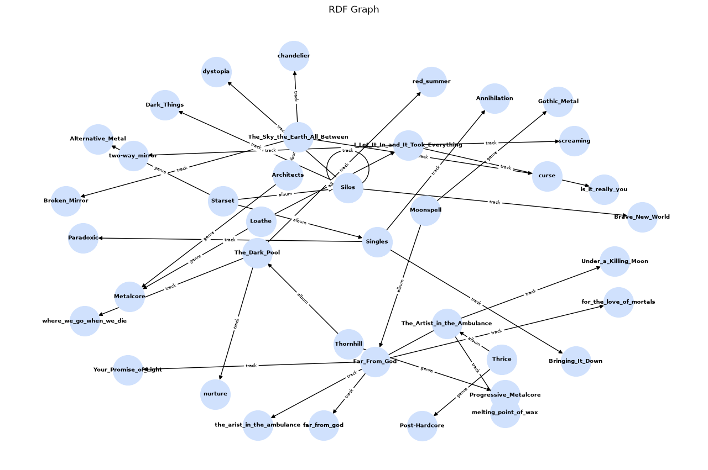

# Лабораторна робота №1: Semantic Web, RDF та SPARQL

## Опис завдання
* **Предметна область:** Музична індустрія.
* **Вимоги:**
  * Побудувати RDF-граф за допомогою Python та RDFLib (понад 5 класів, 5 зв'язків, 20 сутностей, 50+ трійок).
  * Використати онтології Schema.org, OWL та типи даних XSD.
  * Виконати експорт у формати Turtle та N-Triples, перевірити зворотне зчитування.
  * Реалізувати 5 SPARQL-запитів (фільтрація, сортування, агрегація, перехід через 3 зв'язки).
  * Зв'язати локальний граф із Wikidata через `owl:sameAs` та виконати федеративний запит.
  * Зробити візуалізацію графу.
* **Питання:**
* Які музичні композиції вийшли після 2023 року?
* Який повний перелік музичних гуртів представлений у базі за алфавітом?
* Які треки належать гурту Starset?
* Скільки треків має кожен виконавець у базі даних?
* До якого альбому, гурту та жанру належить трек "melting point of wax"?

## Структура графу
* Онтології: Schema.org (`schema:`), OWL (`owl:`), XSD (`xsd:`), власний префікс `http://example.org/music/` (`ex:`).
* Класи (5):** `schema:MusicGroup`, `schema:MusicAlbum`, `schema:MusicRecording`, `schema:Genre`, `schema:Country`.
* Зв'язки: `schema:name`, `schema:album`, `schema:track`, `schema:byArtist`, `schema:genre`, `schema:locationCreated`, `schema:datePublished`, `owl:sameAs`.
* Обсяг: понад 30 унікальних вузлів, понад 170 RDF-трійок.

### Приклади трійок (Turtle)
```turtle
@prefix ex: [http://example.org/music/](http://example.org/music/) .
@prefix schema: [http://schema.org/](http://schema.org/) .
@prefix xsd: [http://www.w3.org/2001/XMLSchema#](http://www.w3.org/2001/XMLSchema#) .

ex:Architects a schema:MusicGroup ;
    schema:name "Architects"^^xsd:string ;
    schema:genre ex:Metalcore ;
    schema:album ex:The_Sky_the_Earth_All_Between .
```
## граф
 
