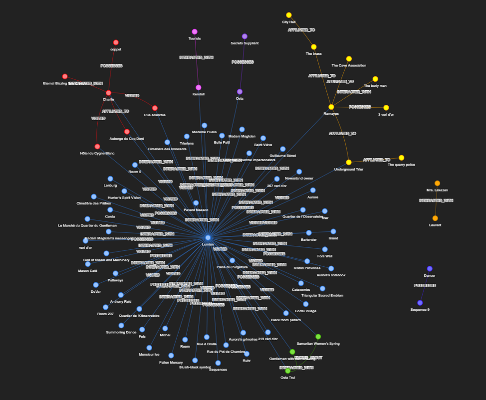

**1\. Опис предметної області, джерела даних і сформульовані запитання**

Предметна область: фентезі-роман «Circle of Inevitability». Текст характеризується високою щільністю іменованих сутностей, складною системою містики, міста та розгалуженою мережею взаємовідносин між персонажами та фракціями.

Джерело даних: відібрано 10 розділів з початку другого тому у форматі .txt. Загальний обсяг становить близько 17 000 слів англійською мовою.

**Сформульовані запитання.**

Однозначні:

1\. Room number that Lumian booked at the Auberge du Coq Doré?

2\. Why was madame Magician's messenger annoyed when she took Lumian's letter?

3\. How did Lumian get past the checkpoint into Trier?

Синтезні:

4\. How are Lumian, Madam Magician, and Osta Trul connected, and why did Lumian trip him up after their first meeting?

5\. Why was Lumian looking for an information broker, what was his name and who gave his contact?

**2\. Схема сутностей та результати екстракції**

Для екстракції фактів використано локальну модель llama3.1 через Ollama із застосуванням Pydantic для жорсткої типізації structured output.

**Схема сутностей (Pydantic):**

**Типи сутностей:** Character, Location, Pathway_Sequence, Organization, Item_Artifact.

**Типи зв'язків:** VISITED, POSSESSES, INTERACTED_WITH, AFFILIATED_TO, KNOWS_ABOUT.

**Приклади видобутих фактів:**

"source_file": "chapter119.txt",  
"subject": "Lumian",  
"predicate": "INTERACTED_WITH",  
"target": "Charlie",  
"context": "Conversed with Charlie in the washroom"

"source_file": "chapter119.txt",
"subject": "Lumian",  
"predicate": "VISITED",  
"target": "Auberge du Coq Doré",  
"context": "Went to Auberge du Coq Doré to meet Anthony Reid"

"source_file": "chapter119.txt",  
"subject": "Lumian",  
"predicate": "POSSESSES",  
"target": "Fallen Mercury",  
"context": "Carried Fallen Mercury

"source_file": "chapter110.txt",  
"subject": "Ramayes",  
"predicate": "AFFILIATED_TO",  
"target": "The Cave Association",  
"context": "Ramayes mentions the Cave Association"

"source_file": "chapter115.txt",  
"subject": "Lumian",  
"predicate": "KNOWS_ABOUT",  
"target": "Samaritan Women's Spring",  
"context": "Legend"

**Результат ручної перевірки вибірки:** екстракція показала високу точність у визначенні персонажів та їхніх взаємодій, проте виявлено типові помилки LLM:

Модель фіксує сам факт відвідування локації (Lumian VISITED Auberge du Coq Doré), але часто опускає специфічні деталі в полі context (номер кімнати), якщо це прямо не вимагається у промпті.

Фізичні дії (побиття, підніжка) іноді узагальнюються до нейтрального спілкування в межах INTERACTED_WITH, що призводить до втрати специфіки сцени.

**3\. Метод векторного пошуку та порівняння з keyword-пошуком**

Корпус текстів розбито на чанки за допомогою RecursiveCharacterTextSplitter. Розмір чанка встановлено у 800 символів із перекриттям (overlap) 150 символів. Такий розмір захоплює 2-3 абзаци художнього тексту, зберігаючи контекст діалогів, а перекриття запобігає розриву зв'язків між іменами та діями. Ембединги згенеровано локальною моделлю nomic-embed-text та збережено у векторній базі ChromaDB. Класичний пошук реалізовано через алгоритм TF-IDF.

**Порівняння:**

**Перевага семантичного пошуку:**

На запит _"Why was madame Magician's messenger annoyed when she took Lumian's letter?"_ векторний пошук успішно знайшов фрагмент. В оригіналі реакція описувалася через синонім "angry". Векторна модель зрозуміла концепт невдоволення умовами, тоді як TF-IDF втратив релевантність через відсутність точного збігу ключових слів.

**Перевага keyword-пошуку (TF-IDF):**

На запит _"Room number that Lumian booked at the Auberge du Coq Doré?"_ векторний пошук видав загальні описи готелю або інших кімнат, оскільки багатовимірний простір розмиває конкретні числа, сприймаючи їх як абстрактні координати. TF-IDF знайшов чанк із номером завдяки високій вазі рідкісного токена "207".

**4\. Візуалізація графа знань та GraphRAG vs Vector-RAG**

 

GraphRAG

Based on the community summaries, here's a comprehensive answer to the question:

How are Lumian, Madam Magician, and Osta Trul connected?

Lumian, Madam Magician, and Osta Trul are connected through their interactions and relationships in the world of the "Circle of Inevitability" novel. Lumian is a key character who is guided through Underground Trier by Ramayes, and he interacts with various entities, including Madam Magician's messenger. Osta Trul is a complex figure who is negotiating with Lumian, attempting to earn his trust, while also dealing with a debt to a Gentleman with a diamond ring.

Why did Lumian trip Osta Trul up after their first meeting?

Unfortunately, the community summaries do not provide a clear answer to this question. However, based on the connections and relationships between the characters, it is possible to infer that Lumian's actions may be related to his growing involvement in the city's mysterious world and his interactions with various characters, including Osta Trul. It is also possible that Lumian's actions may be driven by his curiosity, resourcefulness, and determination, as highlighted in the main themes of the cluster.

To provide a more specific answer, it would be helpful to have more information about the novel and its plot. However, based on the community summaries, it appears that Lumian's interactions with Osta Trul may be a pivotal moment in the story, and the outcome of their meeting may have significant consequences for the plot.

Some possible explanations for Lumian tripping up Osta Trul after their first meeting could include:

Lumian's growing suspicion of Osta Trul's intentions, leading him to take action to protect himself or others.

Lumian's discovery of Osta Trul's debt to the Gentleman with a diamond ring, leading him to try to help Osta Trul or use this information to his advantage.

Lumian's own motivations and goals, which may be at odds with Osta Trul's interests, leading to a confrontation or misunderstanding between the two characters.

Ultimately, the exact reason for Lumian tripping up Osta Trul after their first meeting is not clear from the community summaries, and more information about the novel and its plot would be needed to provide a more specific answer.

Standard RAG

Based on the provided text excerpts, here's a comprehensive answer to the question:

Connection between Lumian, Madam Magician, and Osta Trul:

Lumian, Madam Magician, and Osta Trul are connected through a series of events and interactions. Here's a brief summary:

1\. Lumian and Osta Trul's first meeting: Lumian meets Osta Trul, who is initially feigning death on the floor. Lumian discovers that Osta has some knowledge of mysticism and is surprised by Osta's reaction to a mysterious figure with a pipe.

2\. Lumian's request to Osta Trul: Lumian asks Osta to help him acquire a gathering organizer's approval to attend a gathering involving Beyonder materials. Osta agrees, and Lumian rewards him with a gold coin.

3\. Madam Magician's mission: Lumian is aware of Madam Magician's mission, which might be connected to the gathering involving Beyonder materials. He believes that attending the gathering will help him acquire weapons, materials, Sealed Artifacts, and arcane knowledge.

4\. Lumian's plan to earn Osta Trul's trust: Lumian is instructed to earn Osta's trust and reveal his powers when the time is right. This suggests that Lumian's interactions with Osta are part of a larger plan.

Why Lumian tripped Osta up after their first meeting:

Lumian tripped Osta up after their first meeting because he was trying to test Osta's knowledge and reaction. Lumian was surprised by Osta's feigned death and his reaction to the mysterious figure with a pipe. By tripping Osta up, Lumian was likely trying to gauge Osta's trustworthiness and assess his potential usefulness in Lumian's plans.

Additional connections and insights:

Lumian's interactions with Osta Trul are part of a larger plan to acquire knowledge, materials, and powers.

Madam Magician's mission is connected to the gathering involving Beyonder materials, which suggests that Lumian's goals and Madam Magician's mission are aligned.

Lumian's plan to earn Osta's trust and reveal his powers when the time is right implies that Lumian has a hidden agenda and is working towards a specific goal.

Коментарі:

GraphRAG

How are Lumian, Madam Magician, and Osta Trul connected?

В цілому правильно, але немає чіткої відповіді, що мадам Маг написала лист Люміану знайти Осту та заручитись його підтримкою, що і є зв'язком.

Why did Lumian trip Osta Trul up after their first meeting?

Правильна догадка, але відповідь чітко була у тексті:

Osta tripped over Lumian's right foot, which had swiftly extended, and crashed to

the ground. His nose bridge turned blue, and his gaunt face swelled.

Standard RAG

Все правильно та співпадає з оригіналом.

Проблема GraphRAG**:** працює не з оригінальним текстом, а з тим, що зміг витягнути LLM на Етапі 2 у facts.json. Через це виникає зіпсований телефон.

Якщо під час екстракції LLM не створила зв'язок Lumian -> INTERACTED_WITH -> Osta Trul (context: tripped him over his right foot), ця інформація втрачається для графа.

Далі граф робить резюме спільнот (ще одне стиснення інформації).

У результаті GraphRAG чудово розуміє "хто є хто" і які фракції існують, але сліпий до мікроподій (як-от підніжка), якщо вони не були явно виділені як ключові факти на самому початку. Він намагається вгадати. бо не бачить тексту.

Перевага Standard RAG: доступ до сирого тексту. Standard RAG не стискає текст у факти. Він знаходить шматок тексту, де є слова "Osta", "tripped", "Lumian", бере цілий абзац (де написано про праву ногу і розбитий ніс) і дає його LLM. Модель читає оригінал і дає точну відповідь.

Цей експеримент доводить, що GraphRAG не підходить для пошуку конкретних подій чи причинно-наслідкових дій - він створений для розуміння загальної картини (наприклад, "Які сили діють у підземному Трірі?"). Для питань типу "хто кого вдарив і як" Vector RAG завжди буде кращим, бо він працює з оригінальним контекстом без втрат при екстракції.

**5\. Помилковий та виправлений приклад під час розробки**

Помилка: під час обробки насиченого розділу (chapter 110) скрипт екстракції завершувався з помилкою валідації Pydantic: 1 validation error for DocumentKnowledge. Invalid JSON: EOF while parsing a value at line 2032 column 1...

Причина: локальна модель llama3.1 має обмеження на максимальну кількість згенерованих токенів за замовчуванням (2048). Через велику кількість сутностей у тексті, модель не встигала завершити генерацію JSON і обривала відповідь на півслові. Pydantic не міг розпарсити пошкоджений JSON.

Виправлення: у виклик API Ollama було додано конфігураційний словник options, який зняв ці обмеження. Було збільшено ліміт вихідних токенів (num_predict: 4096) та розширено контекстне вікно (num_ctx: 8192) для безперебійного читання всього чанку тексту.

**6\. Висновки**

LLM-екстракція є потужним інструментом для структурування сирих текстів, але супроводжується втратою мікродеталей на користь абстрактних концепцій. Використання жорстких схем є важливим для стабільності пайплайну.

Семантичний та ключовий пошук вирішують різні завдання. Векторний пошук необхідний для синонімічних запитів та пошуку за сенсом, тоді як для точних ідентифікаторів (числа, номенклатура) TF-IDF залишається фаворитом. Оптимальним рішенням є їхнє гібридне використання.

GraphRAG та Standard RAG мають різні зони відповідальності. Standard RAG працює з сирим контекстом і забезпечує фактологічну точність щодо локальних подій. GraphRAG синтезує макроінформацію і найкраще підходить для відповідей на запитання про глобальні тенденції, зв'язки та лор, які неможливо знайти в одному конкретному абзаці тексту.